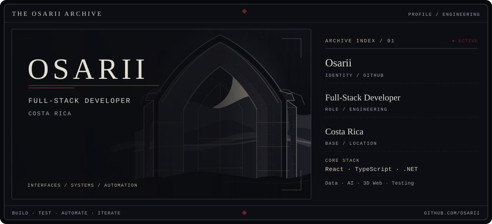

<picture>
  <source media="(prefers-color-scheme: dark)" srcset="assets/profile-banner-dark.svg">
  <source media="(prefers-color-scheme: light)" srcset="assets/profile-banner-light.svg">
  
</picture>

 

Building interfaces, systems, automation, and interactive experiences.

---

## About

I'm **Osarii**, a Full-Stack Developer and Computer Engineering student in Costa Rica. I build web applications from interface to data flow, with a focus on software that works well and feels considered.

- Building with **React, TypeScript, C# and .NET**
- Exploring **automation, AI integrations, data systems and 3D web**
- Caring about **architecture, testing, responsiveness and visual quality**

## Tools of the Craft

 

Also working with Node.js · PHP · Laravel · Supabase · Three.js · React Three Fiber · Rapier · Zustand · Playwright · Vitest · JSON Server · n8n · webhooks

## Selected Work

<table>
<tr>
<td width="50%" valign="top">
01 / SECURITY INTERFACES
<h3><a href="https://github.com/Osarii/Cyb3r_Soc">CYB3R_SOC ↗</a></h3>

A responsive security operations interface for simulated threat monitoring, incident workflows, and DDoS mitigation.

React · TypeScript · Three.js · Recharts · Playwright
</td>
<td width="50%" valign="top">
02 / INTERACTIVE SYSTEMS
<h3><a href="https://github.com/Osarii/BOKAGEDDON">BONKAGEDDON ↗</a></h3>

A 3D survivor-like browser game with physics combat, procedural audio, local scores, and optional run telemetry.

React 19 · TypeScript · React Three Fiber · Rapier · Zustand
</td>
</tr>
<tr>
<td width="50%" valign="top">
03 / DATA SYSTEMS
<h3><a href="https://github.com/Osarii/enterprise-data-reconciliation">Enterprise Data Reconciliation ↗</a></h3>

An ERP/CRM CSV reconciliation workflow for field mapping, data quality, exception review, analytics, and reports.

React · TypeScript · Material UI · Vitest
</td>
<td width="50%" valign="top">
04 / WORK IN PROGRESS
<h3><a href="https://github.com/Osarii/decisionops-inventory-dss">DecisionOps Inventory DSS ↗</a></h3>

An early React foundation for inventory decision support, with routing and mock stock data. Risk analysis is planned.

React · Vite · React Router · JSON Server
</td>
</tr>
</table>

## Current Focus

Cybersecurity interfaces · Data-driven business systems · Workflow automation · AI integrations · Interactive 3D web

## GitHub Signals

<picture>
  <source media="(prefers-color-scheme: dark)" srcset="https://github-profile-summary-cards.vercel.app/api/cards/profile-details?username=Osarii&theme=github_dark">
  <source media="(prefers-color-scheme: light)" srcset="https://github-profile-summary-cards.vercel.app/api/cards/profile-details?username=Osarii&theme=github">
  
</picture>

---

BUILD · TEST · AUTOMATE · ITERATE 
<a href="https://github.com/Osarii">@Osarii</a>

