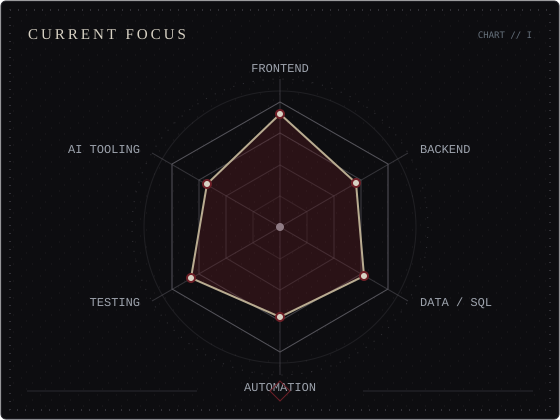
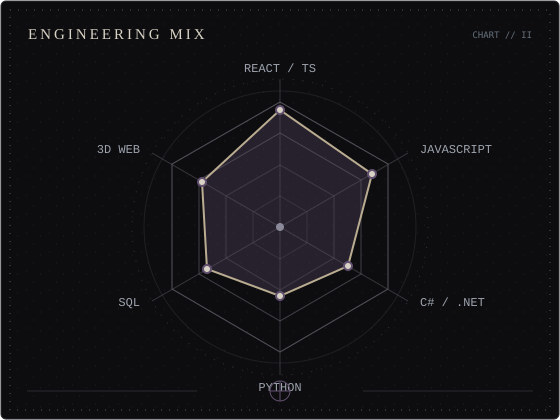

<picture>
  <source media="(prefers-color-scheme: dark)" srcset="assets/profile-banner-dark.svg">
  <source media="(prefers-color-scheme: light)" srcset="assets/profile-banner-light.svg">
  
</picture>

 

 

## About

Hi, I'm **Osarii** — a Full-Stack Developer and Computer Engineering student from Costa Rica. I turn ideas into working software: modern web applications, data-driven systems, automation workflows, and interactive experiences.

My current work spans frontend engineering, application architecture, AI-assisted development, automation, data systems, and experimental 3D interfaces.

## Tools of the Craft

 

 

React Three Fiber · Rapier · Zustand · SQL · JSON Server · n8n · Gemini API · Webhooks · Playwright

## Engineering Domains

<table>
<tr>
<td width="50%" align="center" valign="top">

<picture>
  <source media="(prefers-color-scheme: dark)" srcset="assets/focus-radar-dark.svg">
  <source media="(prefers-color-scheme: light)" srcset="assets/focus-radar-light.svg">
  
</picture>

</td>
<td width="50%" align="center" valign="top">

<picture>
  <source media="(prefers-color-scheme: dark)" srcset="assets/stack-radar-dark.svg">
  <source media="(prefers-color-scheme: light)" srcset="assets/stack-radar-light.svg">
  
</picture>

</td>
</tr>
</table>

Directional snapshots of current engineering focus—not objective proficiency scores.

## Featured Work

| | Project | What it builds | Core technologies |
|:--:|---|---|---|
| I | **[CYB3R_SOC](https://github.com/Osarii/Cyb3r_Soc)** | A responsive security-operations interface for simulated threat monitoring, incident workflows, DDoS mitigation, and data-rich dashboards. | React · TypeScript · Three.js · Recharts · Zustand · Playwright |
| II | **[BONKAGEDDON](https://github.com/Osarii/BOKAGEDDON)** | A 3D survivor-like browser game with physics-based combat, procedural audio, persisted scores, and optional run telemetry. | React 19 · TypeScript · React Three Fiber · Rapier · Zustand · JSON Server · n8n |
| III | **[Enterprise Data Reconciliation](https://github.com/Osarii/enterprise-data-reconciliation)** | An ERP/CRM CSV reconciliation workflow with field mapping, validation, exception review, analytics, history, and reports. | React · TypeScript · Material UI · Vitest · NestJS · PostgreSQL · Prisma |
| IV | **[DecisionOps Inventory DSS](https://github.com/Osarii/decisionops-inventory-dss)** | An early-stage inventory decision-support foundation with routing and mock stock data, built toward risk and reorder analysis. | React · Vite · React Router · JSON Server |

## Current Expeditions

- Cybersecurity interfaces and threat visualization
- Data-driven business systems and software architecture
- Workflow automation, webhooks, and AI integrations
- Interactive and 3D web experiences
- Testing, responsiveness, and visual quality

## Archive Signals

<picture>
  <source media="(prefers-color-scheme: dark)" srcset="https://github-profile-summary-cards.vercel.app/api/cards/profile-details?username=Osarii&theme=github_dark">
  <source media="(prefers-color-scheme: light)" srcset="https://github-profile-summary-cards.vercel.app/api/cards/profile-details?username=Osarii&theme=github">
  
</picture>

---

BUILD · TEST · AUTOMATE · ITERATE 
──────── ◇ ──────── 
THE OSARII ARCHIVE · @Osarii

