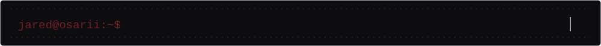

 

 

About Me

I'm Jared Prendas, a Computer Engineering student from Costa Rica focused on building practical software solutions, modern web applications, APIs and data-driven business systems.

I enjoy taking projects from an idea to a working product: designing interfaces, implementing application logic, connecting data, debugging problems and continuously improving the user experience.

Building full-stack and business-oriented applications

Working with React, TypeScript, JavaScript, C# and .NET

Developing and consuming REST APIs

Working with SQL databases and relational data

Interested in data analysis, automation and AI-assisted development

Continuously improving my skills in software architecture and clean development practices

Tech Stack

Frontend

Backend & Programming

Tools

  

Featured Projects

 Enterprise Data Reconciliation Platform

Enterprise-focused platform for comparing and reconciling information between different data sources.

Highlights: reconciliation engine, field mapping, reconciliation history, analytics, metrics, reporting and PDF export.

React TypeScript Vite Data Processing Analytics

Status: Active development

🧟 Zombie Outbreak: Containment

Survival shooter built with HTML, CSS and vanilla JavaScript.

Wave-based combat, multiple weapons, progression, upgrades, bosses, game modes, persistent progress, achievements, companions, visual effects and procedural audio.

JavaScript HTML CSS Game Development

 AI Financial Solution

Collaborative project focused on processing financial expense data and generating business-oriented reports.

JavaScript HTML CSS Data Visualization AI-Assisted Development

 TaskFlow — Git & Pull Request Practice

Project focused on structured Git workflows, branches, commits and pull requests.

JavaScript Git GitHub Pull Requests

Current Focus

Area

Technologies / Focus

Frontend

React • TypeScript • JavaScript

Backend

C# • .NET • REST APIs

Data

SQL • Data Reconciliation • Reporting

Workflow

Git • GitHub • Branches • Pull Requests

Learning

Software Architecture • Full Stack Development

GitHub Analytics

  

  

I see every project as an opportunity to strengthen both technical skills and problem-solving ability. My goal is to keep building software that is useful, maintainable and increasingly closer to real-world production standards.

Let's Connect

I'm open to connecting with developers, teams and people interested in technology and software development.

  

Thanks for visiting my profile.

